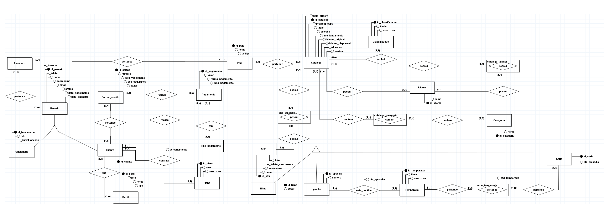
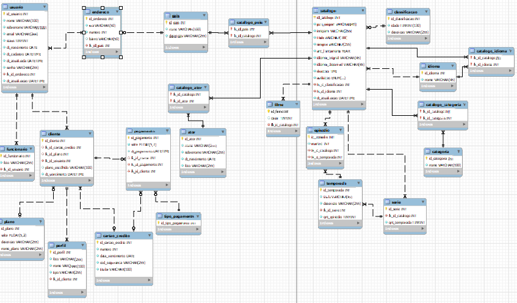

# Projeto Banco de dados

Este projeto tem intuito de demonstrar o conteudo aprendido em sala de aula no curso de **DBA**, para insto foi escolhido um banco de dados para plataformas de streaming.

## Modelo Conceitual

## Modelo Logico

## Tabelas

- tb_ator
- tb_cartao_credito
- tb_catalogo
- tb_catalogo_ator
- tb_catalogo_categoria
- tb_catalogo_idioma
- tb_catalogo_pais
- tb_categoria
- tb_classificacao
- tb_cliente
- tb_endereco
- tb_episodio
- tb_filme
- tb_funcionario
- tb_idioma
- tb_pagamento
- tb_pais
- tb_perfil
- tb_plano
- tb_serie
- tb_temporada
- tb_tipo_pagamento
- tb_usuario

## Views

- **View1:**  vw_usuario - Esta visualização deve conter os todos os dados de todos os usuários, deseja-se também saber quais são funcionários e quais são clientes, o endereço de cada um e seu pais de origem,  quantos perfis cada um tem e qual é o seu plano.

- **View2:** vw_catalogo - Esta visualização deve conter todos os dados do catalogo, identificando series e filmes, (não devem estar presente os episodios nesta view), o idioma original e quantos idiomas são possíveis escolher, a classificação indicativa e suas categorias.

- **View3:** vw_episodio - Esta visualização deve conter todos os dados dos episódios, qual sua serie, e de qual temporada ele é.

- **View4:** vw_temporada - Esta visualização deve conter todos os dados da temporada, a sua quantidade de episodios, e sua série.

- **View5:** vw_ator - Deve conter todos os dados dos atores, quantidades de filmes feito por ele, quantidade de series feita por ele.

- **View6:** vw_pagamento - Deve conter todos os dados de pagamento, seu tipo, o nome do cliente, seu plano e data de vencimento.

- **View7:** deve conter todos os dados do perfil e seu cliente.

## Funções

- **Function1:** fn_remove_acento essa função remove todos os acentos, e transforma letras maiusculas em minuscula.

## Procedures

- **Procedures1:** procedure de INSERT valida dados strings removendo acentos e trasnformando letra maiusculas em minuscula.

- **Procedures2:** procedure de UPDATE valida dados strings removendo acentos e trasnformando letra maiusculas em minuscula.

- **Procedures3:** procedure de DELETE valida dados strings removendo acentos e trasnformando letra maiusculas em minuscula.

## Scripts

|Scripts    |Clique aqui|
|-----------|-----------|
|DDL                |[Clique aqui](./Scripts/DDL.sql)|
|Dados              |[Clique aqui](./Scripts/DADOS_TESTE.sql)|
|Views              |[Clique aqui](./Scripts/VIEW.sql)|
|Funções            |[Clique aqui](./Scripts/FUNCTION.sql)|
|Procedures insert  |[Clique aqui](./Scripts/procedure_INSERT.sql)|
|Procedures delete  |[Clique aqui](./Scripts/procedure_DELETE.sql)|
|Procedures update  |[Clique aqui](./Scripts/procedure_UPDATE.sql)|

